# 1st IT Services
## About
1. Short company description: this is a company page that provides different IT services in the field of SAP authorizations. They are present for more then 15 years and need a new website.
2. Link to the page: https://ninaschulte.github.io/1st-it-services/
3. Author: Nina Schulte (maiden name Jesensek).
### Strategy
The main goal of this website is to provide future clients with information about the company and what company can offer. 
### Target
This is B2B business. Company is offering services for small, large business or big corporations. 
## User stories
| ID | User Stories |
|----|-------------|
| 1  | As a first-time user, I want to be able to easily navigate through the website, so that I can find the content. |
| 2  | As a user, I want to know how to navigate through the page, so that I can easily explore the website. |
| 3  | As a user, I want to know how to navigate through the page, so that I can easily explore the website. |
| 4  | As a user, I want to know what services the company is offering, so that I can see if they can help my company solve the problem. |
| 5  | As a user, I want to know more about the company, so that I can see if I can trust them. |
| 6  | As a user, I want to have an easy way to contact them, so that I can directly send the company a message. |
| 7  | As a user, I want to see the company's email, phone, and address, so that I am sure there is a legit company behind. |
| 8  | As a user, I want to see the company's email, phone, and address, so that I am sure there is a legit company behind. |
| 9  | As a user, I want to see a thank you page once I submit the contact form, so that I know my message was received. |
| 10 | As a user, I want to see the company's social media links, so that I can follow them there. |
## Design
### Responsive layout

### Wireframe
The idea for the page was to create onepager. When user click on any of the menu item, user is scroll down to this page. The last wireframe just show how it will look like when user will scroll on the bottom of the page. Note that end design got changed a bit - map is moved above contact form because of visual reasons - looks nicer.
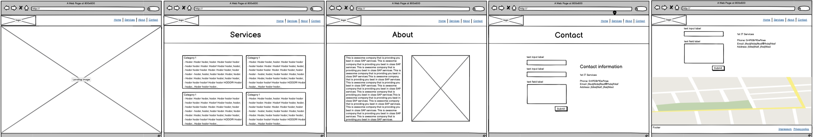
### Color palette
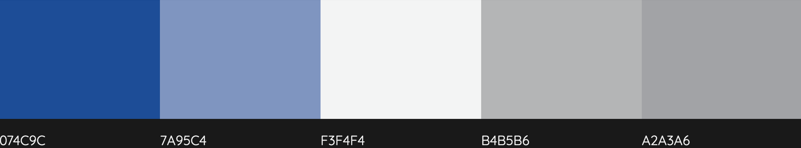
### Typography
Used for headings and parahraphs - font Ubunto
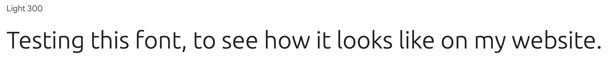
## Features
### Navigation
The navigation section of this project consists of a logo positioned on the far left, accompanied by links to key pages such as "Contact," "About," and "Services." This navigation setup aims to provide users with easy access to essential sections of the website.
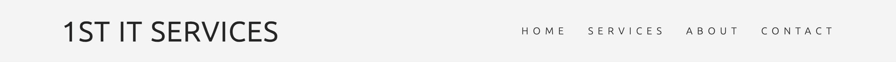
### Main
#### Hero
Hero image with introduction text that inform customer about purpose of this page. 
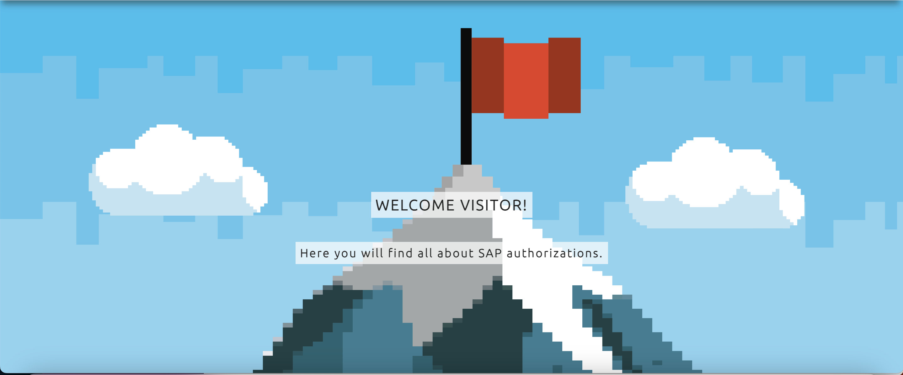
#### Services
Services page shows to the user all services that company provide. All services are clustered into four sections for easy scanning. 
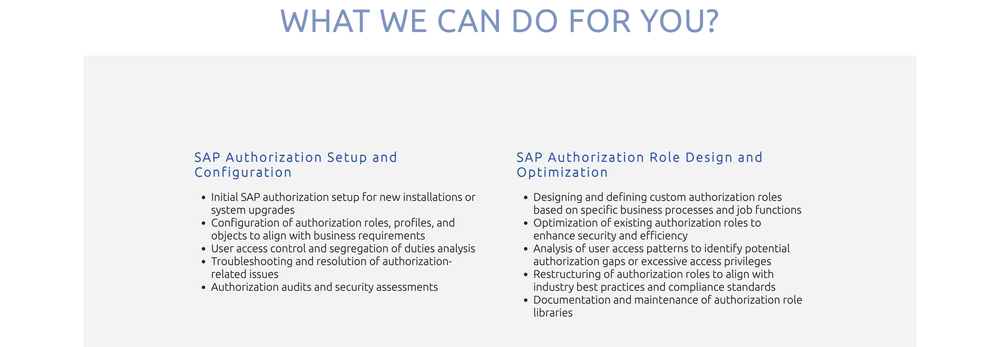
#### About
About page is introduction page of the company to the user. User can read more about the company and can view also the CEO of the company.
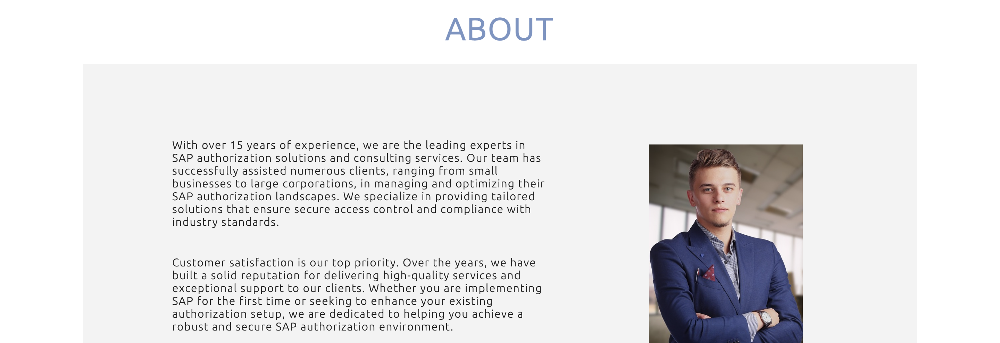
#### Contact
Contact section show google maps and contact information with the contact form. User is enabled here to contact the company.
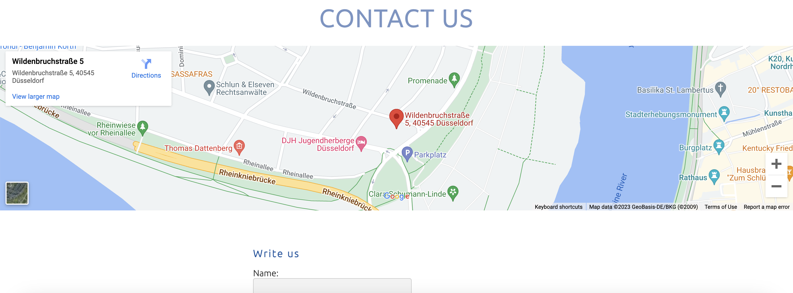
##### Map
User is abel to zoom in and out and view directly on the map how far is the company.
##### Contact Form
User is able to contact the company easy way with just filling up the contact form.

##### Contact Information
User is able to see here all the company information.
### Footer
The footer section of this project includes copyright information, a link to the legal page, and a direct link to the company's official Xing page. It serves as a valuable resource for users, providing essential legal details and facilitating engagement with the company's professional network presence.

### Thank you
After user submit the form, thank you page is shown to the user, to tell the user that message was received.
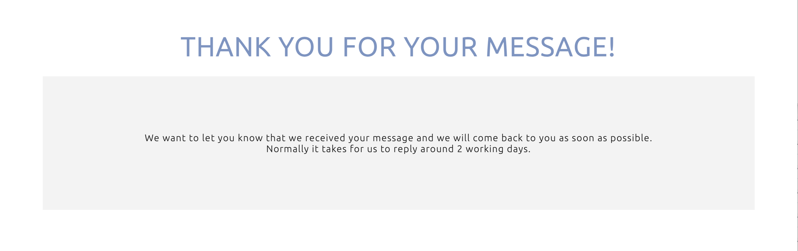
### Impressum
German specific legal page that every company should have.
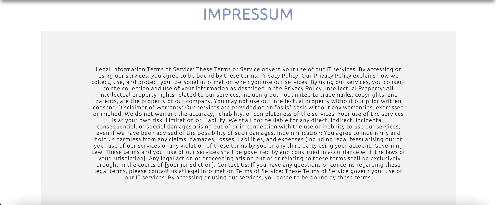
## Testing
### Validator testing
HTML - no errors were retured when passing through the official W3C validator.
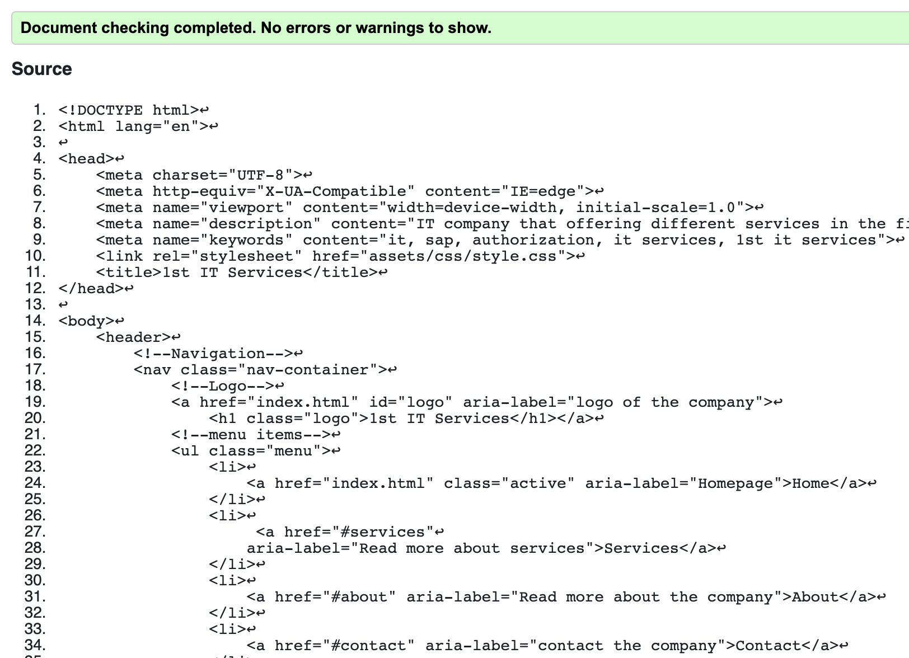
CSS - no errors were retured when passing through the official (Jigsaw) validator.
Accessibility - I confirm that the colours and fonts chosen are easy to read and accessible by running it through lighthouse in devtools. *NOTE - footer colour I needed to take a shade darker gray from the colour pallete because of accessibility reasons.
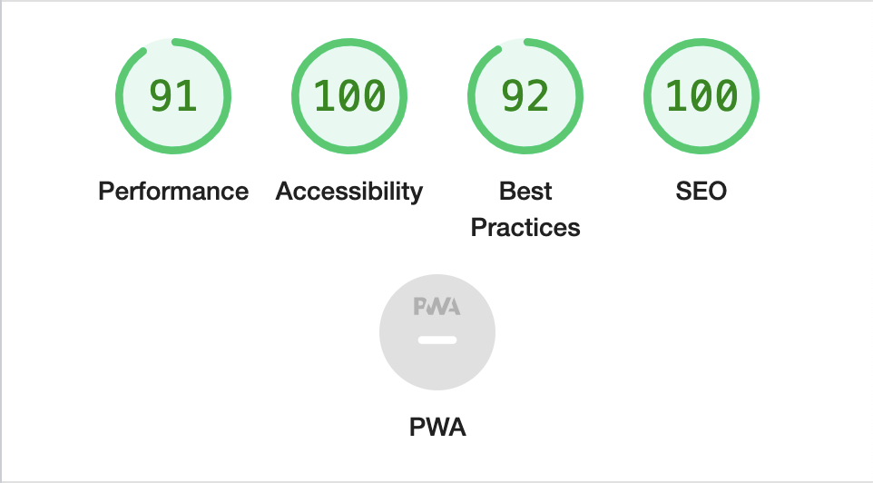
Tests were executed on chrome browser
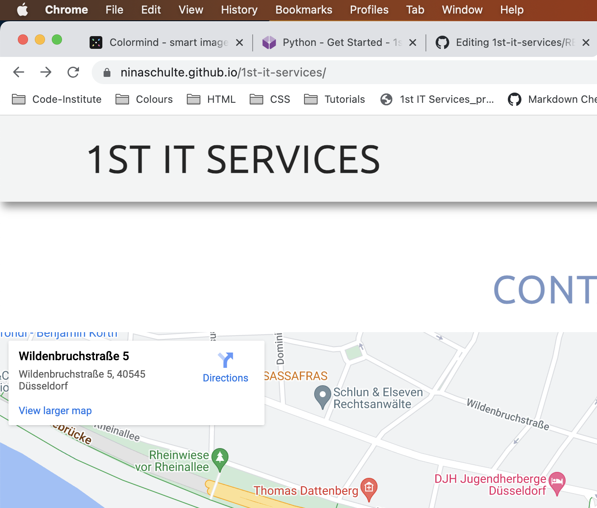
### Manual testing
| ID | User Action | Expected Result | Test Executed on desktop, tablet and mobile device |
|----|-------------|----------------|---------------------------------------------------|
| #1 | Click on logo | Page reload and land on the landing page | Desktop: Y/N, Tablet: Y/N, Mobile: Y/N |
| #2 | Click on "Home" in the menu | Page reload and land on the landing page | Desktop: Y/N, Tablet: Y/N, Mobile: Y/N |
| #3 | Click on "Services" in the menu | Scroll down to "Services" page. | Desktop: Y/N, Tablet: Y/N, Mobile: Y/N |
| #4 | Click on "About" | Scroll down to "About" page | Desktop: Y/N, Tablet: Y/N, Mobile: Y/N |
| #5 | Click on "Contact" | Scroll down to "Contact" page | Desktop: Y/N, Tablet: Y/N, Mobile: Y/N |
| #6 | Click on plus and minus on the map | Map zoom in and zoom out | Desktop: Y/N, Tablet: Y/N, Mobile: Y/N |
| #7 | Click on "Your name" input field. | Input field get active, user can start typing | Desktop: Y/N, Tablet: Y/N, Mobile: Y/N |
| #8 | Click on "Email" input field | Input field get active, user can start typing | Desktop: Y/N, Tablet: Y/N, Mobile: Y/N |
| #9 | Click on "Message" textarea field | Textarea get active, user can start typing | Desktop: Y/N, Tablet: Y/N, Mobile: Y/N |
| #9 | User type name, email address and message in textarea and click on "Submit" CTA | User is let to thank you page. | Desktop: Y/N, Tablet: Y/N, Mobile: Y/N |
| #10 | Happy path: User type name in the input field, email address in the input field and message in textarea and click on "Submit" CTA | User is let to thank you page. | Desktop: Y/N, Tablet: Y/N, Mobile: Y/N |
| #11 | Unhappy path: user type invalid email address and tap on "Submit" CTA | Error message appears stating @ is missing. | Desktop: Y/N, Tablet: Y/N, Mobile: Y/N |
| #12 | Unhappy path: user type correct email address and message and tap on "Submit" CTA | Error message appears that name is mandatory field. | Desktop: Y/N, Tablet: Y/N, Mobile: Y/N |
| #13 | User hover over menu items | Menu items change colour - only text | Desktop: Y/N, Tablet: Y/N, Mobile: Y/N |
| #14 | User click on legal page in footer | Open new page with long text. Menu on top and footer on the bottom of the screen | Desktop: Y/N, Tablet: Y/N, Mobile: Y/N |
| #15 | User click on legal page in footer | Open new page with long text. Menu on top and footer on the bottom of the screen | Desktop: Y/N, Tablet: Y/N, Mobile: Y/N |
| #16 | User click on Xing link in footer | Open new page in new tab and land on Xing company page. | Desktop: Y/N, Tablet: Y/N, Mobile: Y/N |
## Credits
### Inspiration
Inspiration I took from [IVZ institut](https://www.institut-vz.si/) page from Slovenia.
### Image source
Image of a [CEO](https://pixabay.com/photos/consulting-hiring-board-executive-4405260/) taken from CEO image taken from.
Image of a [hero](https://www.freepik.com/free-photos-vectors/pixel-hero) image was taken from.
### Main Hero image
For hero image CSS I used styling from "Love Running project"
### Navigation
For navigation I reuse the code that I found [here](https://codepen.io/tedib/pen/mdypQbg).
How to fix the nav position I found on this forum resource [here](https://stackoverflow.com/questions/40772841/how-to-position-fixed-the-navbar-when-using-flexbox).
### Pages
All pages are styled with Flexbox, and I used the knowledge from these tutorials:
- [Tutorial 1](https://www.youtube.com/watch?v=hwbqquXww-U&list=PL4-IK0AVhVjMSb9c06AjRlTpvxL3otpUd&index=1)
- [Tutorial 2](https://www.youtube.com/watch?v=hwbqquXww-U&list=PL4-IK0AVhVjMSb9c06AjRlTpvxL3otpUd&index=2) by [Kevin Powell](https://www.youtube.com/c/KevinPowell)
### Footer
Footer CSS style, I used the code from [here](https://materializecss.com/footer.html).
